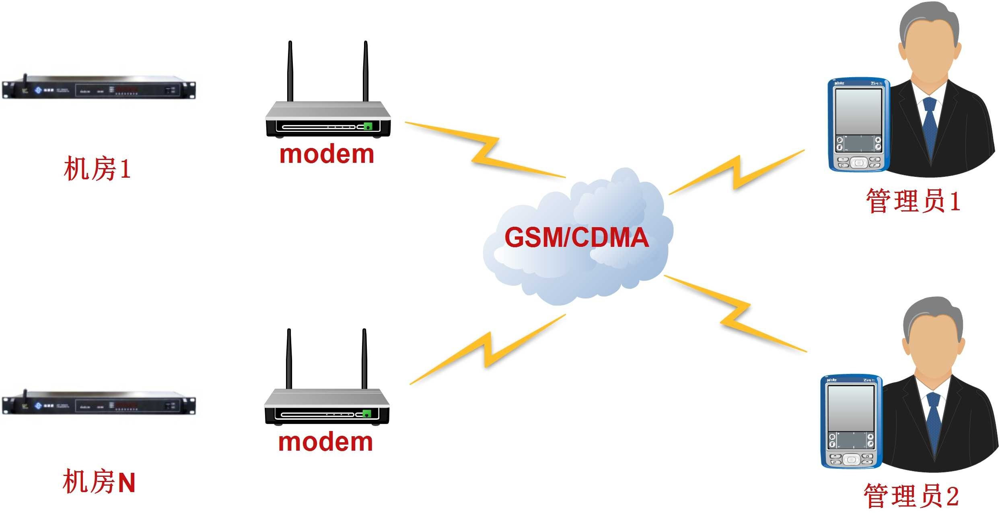

## SMS Gateway ( ISMG )

- 短信网关`ISMG`全称`Internet Short Message Gateway`，
主要是为了解决各网络、各运营商之间的短信互通和SP的接入问题。
它为应用单位收发短信而提供的一个动态数据交换平台系统。

- 通过该系统的接口软件，可以将短信平台与各种系统和软件进行无缝高效相连，
将应用单位的系统随时产生的动态信息转变成手机短信，
通过梦网平台连接移动和联通的短信中心以端口特服号码进行实时中发送和接受，
为各种系统(或软件)建立一个快速的短信双向(或单向)通道，
以便手机用户采用短信方式与SP双向通信，接收SP提供的信息服务。

### 短信网关使用方法

手机用户可以通过短信采用手机点播或网站定制的方式享受以上服务。

- 手机点播的方式
    - 用户在手机的编辑短消息的消息体中，输入需要点播的业务代码，然后在“发送”号码中输入SP的服务代码，发送短信;如果发送成功，稍后即可收到点播的信息。

- 网站定制的方式
    - 用户登录提供短信信息服务的SP网站，按照页面的提示，注册成为SP的用户，并登记用户的手机号码;SP会将确认密码以短信方式发送给用户，用户以此密码在SP进行确认，确认成功就可以定制SP提供的服务了;用户在SP的页面上定制需要的服务，SP会根据用户的定制信息发送信息到用户手机。

### 短信网关部分功能

- SMPP代理系统遵循SMPP 3.3版本协议与GSM网中短消息中心连接，实现高效、可靠的数据传输。该系统支持流量控制功能，能够根据SMSC的业务量进行发送流量控制。

- 通信代理系统实现与SP等内容供应商的连接和协议互通。它基于TCP/IP协议基础之上，利用CMPP协议与SP之间建立一条安全、高效的传输通道。该系统支持流量控制功能，能够根据本身的业务量进行接收流量控制。

- 防火墙作为短信网关的重要功能组成部分，其功能是对短信网关内部其它相关模块进行保护，实现针对内外访问的包过滤和代理。

- 短消息网关处理系统完成网关的业务处理，包括：向汇接网关进行路由查询，在本地建立短信网关ID、用户手机号码、SP ID及其IP地址对应表的缓存，建立用户手机号码段与SMSC(短信中心)地址的对应表，完成对数据分发功能的支持、计费原始话单的提供及处理等。

- 短信网关计费系统提供短信网关的原始话单记录(CDR)。

- 业务管理系统包括业务管理和网关监控功能。

> [@原文出处](http://www.alotcer.com/index.php?c=article&id=1418)
**如有侵权，请联系删除**

### 常见的短信开头

10657：中国移动的短信网关，只可以发送移动的号码

10655：中国联通的短信网关，只可以发送联通的号码

10659：中国电信的短信网关，只可以发送电信的号码

10658：移动业务网关

10690：10690的通道是由工信部审批，然后在运营商落地而成，
可以三网显示统一一个号码，优质相当优质，不过现在监管又相当严，内容稍有营销性质就会被处罚

我们平时所说的集信通是指浙江联通的一个业务，俗称联通跨网，
可以给三网号码发送，显示号码为联通手机号，优质相对差于106的网关，
但是监管也会稍微松一些，不过现在也严了，官方称有一条投诉罚款6000元，
这个条件摆在这里，也让很多短信公司望而却步！

021、0755、0793、0532等：这些通道主要是由中国电信开出，质量也差于106网关，
2012年垃圾短信曝光之后这些通道疯狂过一段时间，不过由于严格了，
加上各种限制及质量问题，现在几乎销声匿迹了

0061、0085：我目前见过这两条通道，属于国外的卡发，0061是澳大利亚的短信网关，
0085是美国（香港？）的，移动号码接收到短信显示0061或者0085，
联通电信收到显示+61XXXXXXX、+85XXXXXXX，就像别人给你发短信的时候，
有可能显示+86XXXXXXX。这是新兴起的通道，不过由于是国际网关，成本很高，
0061在1毛5以上，0085也在3毛以上